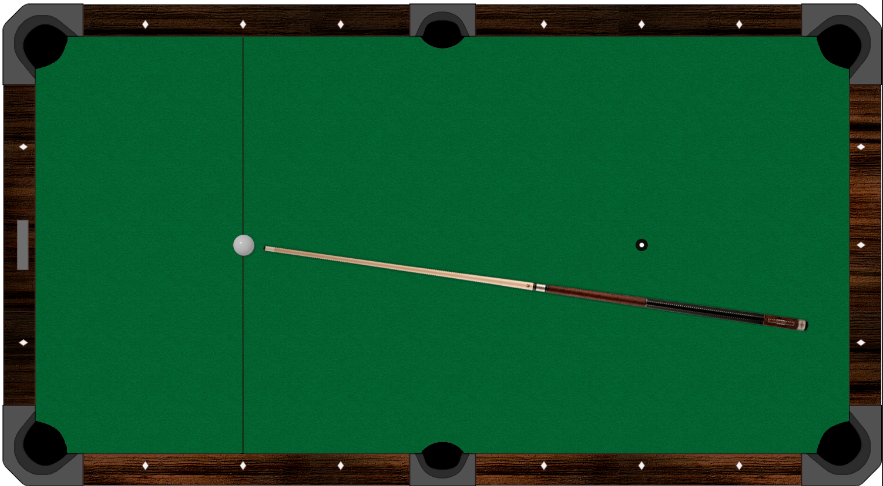

# Billiard

A simple and interactive 2D billiard game built using JavaScript and HTML5 canvas, designed to showcase fundamental concepts in vector math, collision handling, and game mechanics. 

---


---

## Overview

This project demonstrates the mechanics of a billiard game, featuring realistic physics-based ball movement, collision detection, and user interaction with a virtual pool stick. It's intended as a portfolio sample to illustrate skills in game development and JavaScript programming.

---

## Prerequisites

Before running the project, ensure you have the following:

- A modern web browser with JavaScript enabled.
- A local server to handle the `file://` limitations when loading assets, or run directly in a browser extension allowing local file access.

---

## Installation

1. Clone the repository:
   ```bash
   git clone https://github.com/sajjad-sisakhtpour/billiard.git
   ```

2. Navigate to the project folder:
   ```bash
   cd billiard
   ```

3. Open `index.html` in a browser, or serve the project using a local server (e.g., Python's `http.server`):
   ```bash
   python -m http.server
   ```

---

## Usage

- Use the mouse to aim and adjust the stick's rotation.
- Hold the left mouse button to charge power.
- Release the button to shoot.

---

## Examples

Here’s how the game looks in action:

### Screenshots


---

## Documentation

### Key Features:
- **Physics-Based Ball Movement**: Implements realistic velocity and friction.
- **Vector Operations**: Includes custom vector math utilities.
- **User Interaction**: Dynamic stick rotation and power control.

### Code Highlights:
- **Asset Loading**: Efficient sprite management through asynchronous loading.
- **Canvas Rendering**: Smooth rendering of game objects using transformations.

---

## Contributing

Contributions are welcome! Follow these steps:

1. Fork the repository.
2. Create a new branch:
   ```bash
   git checkout -b feature-name
   ```
3. Commit your changes:
   ```bash
   git commit -m "Add feature"
   ```
4. Push to the branch:
   ```bash
   git push origin feature-name
   ```
5. Create a Pull Request.

---

## License

This project is licensed under the MIT License. See the [LICENSE](LICENSE) file for details.

---

## Contact

For inquiries or feedback, reach out:

- **Email**: [sajjad.sisakhtpour@gmail.com](mailto:sajjad.sisakhtpour@gmail.com)
- **GitHub**: [github.com/sajjad-sisakhtpour](https://github.com/sajjad-sisakhtpour)
- **LinkedIn**: [ir.linkedin.com/in/sajad-sisakht-pour](https://ir.linkedin.com/in/sajad-sisakht-pour)

---

## Live Demo

A live version of the game can be hosted and viewed on platforms like GitHub Pages.
[here](https://sajjad-sisakhtpour.github.io/billiard)